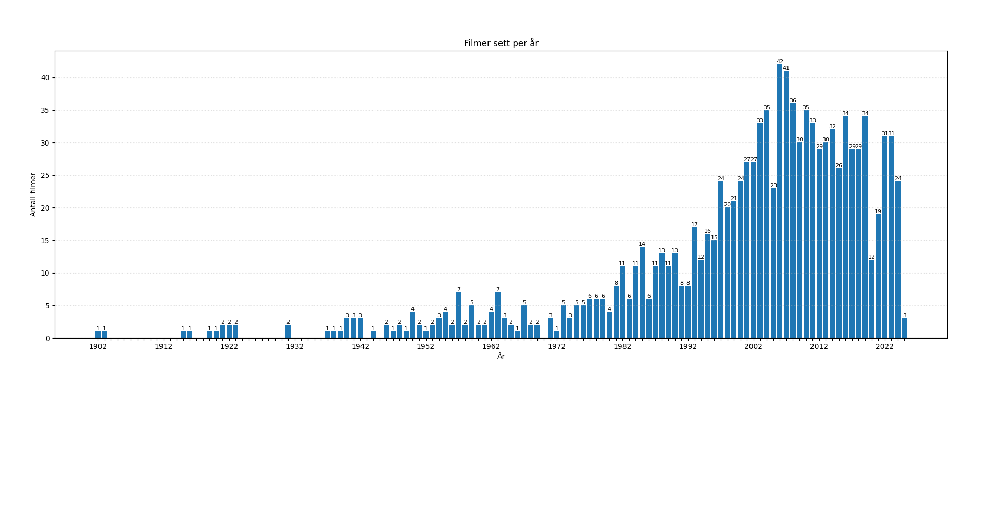

# 🎬 FilmQuest Analytics

A small data analysis project exploring my personal film-watching history from Letterboxd using
**SQL**,**Python**, **SQLite**, and **pandas**.  
The goal is to practice data cleaning, SQL, and visualization while discovering insights about my viewing habits.

---

## 📁 Project Overview

This project loads my Letterboxd data, stores it in a SQLite database, cleans the dataset, and performs exploratory data analysis (EDA) to answer questions such as:

- How many films do I watch per year?
- Which genres and directors do I watch the most?
- How has my watching frequency changed over time?

---

## 🛠️ Tech Stack

- **Python** (pandas, sqlite3, matplotlib)
- **SQLite** for local data storage
- **Jupyter Notebook** / `.py` scripts for analysis

---

## 📊 Example Visualization

Films watched per year based on my Letterboxd history:

> _(Add short insight here once in place)_



---

## 🚀 How to Run

```bash
git clone https://github.com/USERNAME/FilmQuestAnalytics.git
cd FilmQuestAnalytics
pip install -r requirements.txt
python src/analysis.py
```
